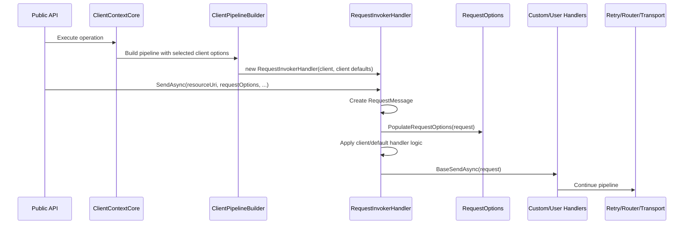
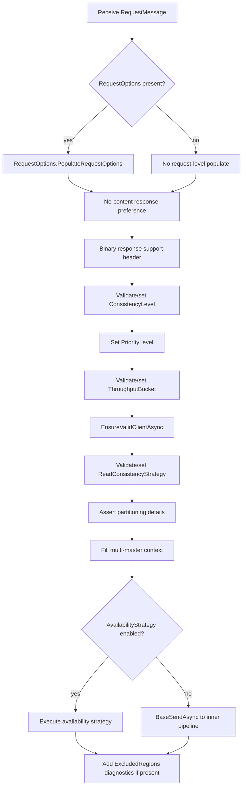
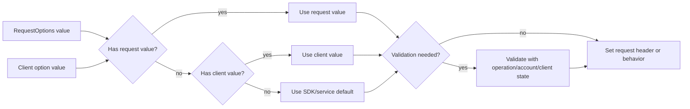

# Request Options Current Behavior

This document maps the current request option materialization behavior for
investigating [Azure/azure-cosmos-dotnet-v3#4952](https://github.com/Azure/azure-cosmos-dotnet-v3/issues/4952).

The issue asks whether client-level request options should move into a broader
`RequestOptions.Populate(RequestMessage, CosmosClient/options)` style flow. The
current behavior is split: request-level options are populated by
`RequestOptions.PopulateRequestOptions(RequestMessage)`, while several
client-level defaults and validations are applied later by
`RequestInvokerHandler`.

This map is based on local checkout `ce9b0ea18` on branch
`diagnostics-gateway-hedging-suppression`.

## Current Request Pipeline

`ClientContextCore` creates the request pipeline and passes selected
`CosmosClientOptions` values into `ClientPipelineBuilder`. The root
`RequestInvokerHandler` stores those values separately from the full
`CosmosClientOptions` object:

- `ConsistencyLevel`
- `ReadConsistencyStrategy`
- `PriorityLevel`
- `ThroughputBucket`

Inside `RequestInvokerHandler.SendAsync(RequestMessage, CancellationToken)`,
the request is materialized in this order:

Important ordering observations:

- `PopulateRequestOptions` runs before custom handlers see the request.
- Client/default handler logic also runs before custom handlers see the request.
- `AddRequestHeaders` runs inside `RequestOptions.PopulateRequestOptions`, before
  handler-level setters for consistency, priority, throughput bucket, and read
  consistency.
- Request-level `PriorityLevel` and `ThroughputBucket` are currently written by
  `RequestOptions.PopulateRequestOptions` and then written again by
  `RequestInvokerHandler` using the same request-level value.
- `ReadConsistencyStrategy` is applied after `ConsistencyLevel`; it does not
  clear a consistency header that was explicitly set earlier.

## RequestOptions.PopulateRequestOptions Map

`RequestOptions.PopulateRequestOptions(RequestMessage)` is request-level only.
It does not receive the `CosmosClient`, `CosmosClientOptions`, or account
configuration.

| Source | Trigger | Request effect | Client-level peer | Notes |
| --- | --- | --- | --- | --- |
| `RequestOptions.Properties` | non-null | Copies entries into `request.Properties` | no | Later used by handlers and some serialization paths. |
| `RequestOptions.IfMatchEtag` | non-null | Adds `If-Match` header | no | `ChangeFeedRequestOptions` hides this property as unsupported. |
| `RequestOptions.IfNoneMatchEtag` | non-null | Adds `If-None-Match` header | no | `ChangeFeedRequestOptions` hides this property as unsupported. |
| `RequestOptions.PriorityLevel` | has value | Adds priority header | yes | Later overwritten/set again by `RequestInvokerHandler.SetPriorityLevel`. |
| `RequestOptions.ThroughputBucket` | has value | Adds throughput bucket header | yes | Later validated and overwritten/set again by `ValidateAndSetThroughputBucket`. |
| `RequestOptions.AddRequestHeaders` | non-null | Invokes caller delegate with `request.Headers` | no | Runs after base request headers above, but before handler-level client/default logic. |
| `RequestOptions.CosmosThresholdOptions` | non-null | No direct populate effect | yes | Used by telemetry recorder, falling back to client telemetry thresholds. |
| `RequestOptions.ExcludeRegions` | non-null | No direct populate effect | no | Copied to `DocumentServiceRequest.RequestContext` and used by routing/diagnostics. |
| `RequestOptions.AvailabilityStrategy` | non-null | No direct populate effect | yes | Selected by `RequestInvokerHandler.AvailabilityStrategy`. |
| `RequestOptions.DisablePointOperationDiagnostics` | true | No direct populate effect | no | Read by `ClientContextCore` while creating diagnostics. |
| `RequestOptions.OperationMetricsOptions` | non-null | No direct populate effect | yes | Used by feed/query telemetry paths. |
| `RequestOptions.NetworkMetricsOptions` | non-null | No direct populate effect | yes | Used by feed/query telemetry paths. |
| `ItemRequestOptions.ConsistencyLevel` | has value | No direct populate effect | yes | Stored in `BaseConsistencyLevel`; applied by `RequestInvokerHandler`. |
| `ItemRequestOptions.ReadConsistencyStrategy` | has value | No direct populate effect | yes | Stored in `BaseReadConsistencyStrategy`; applied by `RequestInvokerHandler`. |
| `ItemRequestOptions.EnableContentResponseOnWrite` | has value | No direct populate effect | yes | Applied by `ShouldSetNoContentResponseHeaders`. |
| `ItemRequestOptions.PreTriggers` | non-empty | Adds pre-trigger include header | no | Item operations only by API contract. |
| `ItemRequestOptions.PostTriggers` | non-empty | Adds post-trigger include header | no | Item operations only by API contract. |
| `ItemRequestOptions.IndexingDirective` | has value | Adds indexing directive header | no | Batch item options also carry indexing directive, but batch serialization handles it separately. |
| `ItemRequestOptions.DedicatedGatewayRequestOptions` | max staleness or bypass set | Adds dedicated gateway cache headers | no | Shared helper validates negative max staleness. |
| `ItemRequestOptions.SessionToken` | non-empty | Adds session token header | no | Uses `RequestOptions.SetSessionToken`. |
| `QueryRequestOptions.PartitionKey` | set on non-document resource | throws `ArgumentException` | no | Guard is inside populate. |
| `QueryRequestOptions.PartitionKey` absent with document query | document resource and not effective PK routing | Adds cross-partition query header | no | Applies when no partition key was provided. |
| `QueryRequestOptions.SessionToken` | non-empty | Adds session token header | no | Uses `RequestOptions.SetSessionToken`. |
| `QueryRequestOptions.ConsistencyLevel` | has value | No direct populate effect | yes | Stored in `BaseConsistencyLevel`; applied by `RequestInvokerHandler`. |
| `QueryRequestOptions.ReadConsistencyStrategy` | has value | No direct populate effect | yes | Stored in `BaseReadConsistencyStrategy`; applied by `RequestInvokerHandler`. |
| `QueryRequestOptions.MaxItemCount` | has value | Sets page size header | no | Uses `CosmosMessageHeaders.PageSize`. |
| `QueryRequestOptions.MaxConcurrency` | value > 0 | Adds parallelize cross-partition query header | no | Only positive values flow. |
| `QueryRequestOptions.EnableScanInQuery` | true | Adds scan-in-query header | no | False/null do not add. |
| `QueryRequestOptions.EnableLowPrecisionOrderBy` | non-null | Adds low precision order-by header | no | Value is converted with `ToString()`. |
| `QueryRequestOptions.ResponseContinuationTokenLimitInKb` | non-null | Adds continuation token limit header | no | Request-level only. |
| `QueryRequestOptions.SupportedSerializationFormats` | operation is `Query` | Sets supported serialization formats | no | Defaults to `DocumentQueryExecutionContextBase.DefaultSupportedSerializationFormats`. |
| `QueryRequestOptions.StartId` | non-null | Sets base64 start id header | no | Also causes read feed key type to become `ResourceId`. |
| `QueryRequestOptions.EndId` | non-null | Sets base64 end id header | no | Also causes read feed key type to become `ResourceId`. |
| `QueryRequestOptions.EnumerationDirection` | has value | Sets enumeration direction header | no | Request-level only. |
| `QueryRequestOptions.PopulateIndexMetrics` | has value | Adds populate index metrics header | no | Uses `CosmosMessageHeaders.Add`. |
| `QueryRequestOptions.PopulateQueryAdvice` | has value | Adds populate query advice header | no | Uses `CosmosMessageHeaders.Add`. |
| `QueryRequestOptions.DedicatedGatewayRequestOptions` | max staleness or bypass set | Adds dedicated gateway cache headers | no | Same helper as item options. |
| `QueryRequestOptions` | always | Adds populate query metrics header | no | Always true for query request options. |
| `ContainerRequestOptions.PopulateQuotaInfo` | true | Adds populate quota info header | no | Container operations only by API contract. |
| `ChangeFeedRequestOptions.PageSizeHint` | has value | No direct populate effect here | no | The override currently calls base populate only. |
| `ChangeFeedRequestOptions.ReadConsistencyStrategy` | has value | No direct populate effect | yes | Stored in `BaseReadConsistencyStrategy`; applied by `RequestInvokerHandler`. |
| `StoredProcedureRequestOptions.EnableScriptLogging` | true | Adds script logging header | no | Stored procedure operations only. |
| `StoredProcedureRequestOptions.SessionToken` | non-empty | Adds session token header | no | Uses `RequestOptions.SetSessionToken`. |
| `StoredProcedureRequestOptions.ConsistencyLevel` | has value | No direct populate effect | yes | Stored in `BaseConsistencyLevel`; applied by `RequestInvokerHandler`. |
| `StandByFeedIteratorRequestOptions.StartTime` | null and no continuation | Sets `If-None-Match: *` | no | Stand-by feed internal path. |
| `StandByFeedIteratorRequestOptions.StartTime` | set and not beginning | Adds `If-Modified-Since` header | no | Uses RFC1123 string format. |
| `StandByFeedIteratorRequestOptions.MaxItemCount` | has value | Adds page size header | no | Internal stand-by feed path. |
| `StandByFeedIteratorRequestOptions` | always | Adds `A-IM: Incremental feed` header | no | Internal stand-by feed path. |
| `TransactionalBatchRequestOptions.SessionToken` | non-empty | Adds session token header | no | Batch-level request options. |
| `TransactionalBatchRequestOptions.ConsistencyLevel` | has value | No direct populate effect | yes | Stored in `BaseConsistencyLevel`; applied by `RequestInvokerHandler`. |
| `TransactionalBatchItemRequestOptions` | per-operation options | No `PopulateRequestOptions` override | partial | Batch operation serialization writes supported per-item state into the batch payload. |
| `PatchItemRequestOptions.FilterPredicate` | set | No direct populate effect here | no | Patch-specific serialization handles it outside this base map. |
| `ReadManyRequestOptions` | used by read many APIs | Converts to `QueryRequestOptions` | yes | It does not override populate directly. |

## Client-Level Defaults Map

The current client-level/default behavior is centralized in
`RequestInvokerHandler`, not in `RequestOptions`.

| Behavior | Request-level source | Client-level source | Precedence | Effect | Risk |
| --- | --- | --- | --- | --- | --- |
| Content response on write | `ItemRequestOptions.EnableContentResponseOnWrite`; `TransactionalBatchItemRequestOptions.EnableContentResponseOnWrite` | `CosmosClientOptions.EnableContentResponseOnWrite` | request > client > default | Adds `Prefer: return=minimal` for document create/replace/upsert/patch when content is disabled | validation-bound |
| Consistency level | `BaseConsistencyLevel` exposed by item/query/stored procedure/batch/read-many options | `CosmosClientOptions.ConsistencyLevel` passed to handler constructor | request > client > account default | Validates against account consistency, then sets consistency header | runtime/account-bound |
| Priority level | `RequestOptions.PriorityLevel` | `CosmosClientOptions.PriorityLevel` passed to handler constructor | request > client > service default | Sets priority header | simple synchronous header/default |
| Throughput bucket | `RequestOptions.ThroughputBucket` | `CosmosClientOptions.ThroughputBucket` passed to handler constructor | request > client > no header | Validates request-level bucket is not used with bulk execution, then sets throughput bucket header | validation-bound |
| Read consistency strategy | `BaseReadConsistencyStrategy` exposed by item/change feed/read-many and query options | `CosmosClientOptions.ReadConsistencyStrategy` passed to handler constructor | request > client > no header | Sets read consistency headers for document resources, with special hub-region behavior for `LastCommittedSingleWriteRegion` | runtime/account-bound |
| Availability strategy | `RequestOptions.AvailabilityStrategy` | `DocumentClient.ConnectionPolicy.AvailabilityStrategy` | gateway disable flag > request > client/connection policy > no strategy | Selects and executes availability strategy around `BaseSendAsync` | runtime-bound |
| Excluded regions | `RequestOptions.ExcludeRegions` | no direct peer | request only | Copied to `DocumentServiceRequest.RequestContext`, used by routing/hedging, and added to diagnostics after response | routing-bound |

### Behavior Details

#### Content response on write

`ShouldSetNoContentResponseHeaders` only returns true for document resource
operations. It only applies to create, replace, upsert, and patch. The helper is
used by `RequestInvokerHandler` for normal item operations and by
`ItemBatchOperation` during batch serialization.

If request-level `EnableContentResponseOnWrite` is set, it overrides the client
option. If it is not set, the client-level option decides. Other
`RequestOptions` subclasses do not trigger this behavior.

#### Consistency level

`ValidateAndSetConsistencyLevelAsync` first checks request-level
`BaseConsistencyLevel`, then the handler's requested client consistency level.
When a level is present, the method obtains/caches account consistency and
validates the requested level with the operation and resource type. Invalid
overrides throw `ArgumentException`; valid overrides set the consistency header.

This path is async and account-state dependent, so it is not a good first
candidate for moving into simple request option population.

#### Priority level

`RequestOptions.PopulateRequestOptions` already adds the request-level priority
header when present. `RequestInvokerHandler.SetPriorityLevel` then recomputes
the effective value: start from client-level priority, override with request
priority if present, then `Set` the header.

This means request-level priority currently has two write sites but one final
effective value.

#### Throughput bucket

`RequestOptions.PopulateRequestOptions` already adds the request-level
throughput bucket header when present. `ValidateAndSetThroughputBucket` then
recomputes the effective value from client-level bucket plus request-level
override.

The request-level bucket is rejected when `CosmosClientOptions.AllowBulkExecution`
is true. A client-level throughput bucket is allowed with bulk execution.

#### Read consistency strategy

`ValidateAndSetReadConsistencyStrategyAsync` checks request-level
`BaseReadConsistencyStrategy` first, then the handler's requested client-level
strategy. It only applies to document resources.

For `LastCommittedSingleWriteRegion`, multi-master accounts throw. For read
operations, the method sets the hub-region processing header and sends
`ReadConsistencyStrategy: LatestCommitted`. For other strategies, it sets the
strategy header directly.

This runs after consistency-level handling. Existing tests assert that an
explicit consistency header can remain when read consistency is also set.

#### Availability strategy

`AvailabilityStrategy(RequestMessage)` first computes
`request.RequestOptions?.AvailabilityStrategy`, falling back to the client
connection policy strategy. On this local branch, a gateway-driven
`disableCrossRegionalHedging` override has absolute precedence: while active,
the handler may emit a one-shot trace datum for a suppressed hedging request and
returns `null` even when request-level or client-level strategy is configured.

When no gateway override suppresses hedging, the selected strategy runs after
partitioning details and multi-master context are filled, and before the inner
handler pipeline is invoked.

The selected strategy is execution behavior, not just header population.

#### Excluded regions

`ExcludeRegions` is not written by `PopulateRequestOptions`. It is read directly
from `RequestOptions` by routing paths:

- `RequestMessage` copies it to `DocumentServiceRequest.RequestContext`.
- `CrossRegionHedgingAvailabilityStrategy` reads and mutates cloned request
  options when constructing hedged requests.
- `RequestInvokerHandler` adds it to diagnostics after a response.

## Precedence Matrix

| Option | Neither set | Client only | Request only | Both set | Invalid/special case |
| --- | --- | --- | --- | --- | --- |
| `EnableContentResponseOnWrite` | no `Prefer` header | client value decides minimal return | request value decides minimal return | request wins | only document create/replace/upsert/patch |
| `ConsistencyLevel` | account default/service behavior | client level after account validation | request level after account validation | request wins | invalid override throws |
| `PriorityLevel` | no priority header | client priority header | request priority header | request wins | request value is written during populate and then set again |
| `ThroughputBucket` | no throughput bucket header | client bucket header | request bucket header | request wins | request bucket with bulk execution throws |
| `ReadConsistencyStrategy` | no read strategy header | client strategy applies to document resources | request strategy applies to document resources | request wins | `LastCommittedSingleWriteRegion` rejects multi-master accounts |
| `AvailabilityStrategy` | no availability strategy | connection policy strategy | request strategy | request wins unless gateway disables hedging | strategy must be internal/enabled to execute |
| `ExcludeRegions` | no excluded-region routing context | no direct client-level peer | request list used by routing/diagnostics | request only | routing may fall back if all regions are excluded |

## Test Coverage Matrix

| Behavior | Existing coverage | Notes |
| --- | --- | --- |
| Base `Properties` and etag population | `HandlerTests.RequestOptionsHandlerCanHandleRequestOptions` | Verifies custom handler can see property and `IfMatch`. |
| Request consistency header | `HandlerTests.RequestOptionsConsistencyLevel` | Covers item/query/stored procedure request options. |
| Client consistency header | `HandlerTests.ConsistencyLevelClient` | Covers client option passed into handler constructor. |
| Request consistency overrides client | `HandlerTests.ConsistencyLevelClientAndRequestOption` | Direct override coverage. |
| Dedicated gateway request options | `HandlerTests.QueryRequestOptionsDedicatedGatewayRequestOptions`; `DedicatedGatewayRequestOptionsTests` | Covers item/query header population and null/default cases. |
| Priority client default | `HandlerTests.PriorityLevelClient` | Covers all enum values. |
| Priority request override | `HandlerTests.TestRequestPriorityLevelTakesPrecedence` | Covers request > client. |
| Throughput bucket client default | `HandlerTests.TestThroughputBucketClientOptions` | Covers bulk and non-bulk client-level bucket. |
| Throughput bucket request override | `HandlerTests.TestRequestThroughputBucketTakesPrecedence` | Covers request > client. |
| Throughput bucket request with bulk | `HandlerTests.TestRequestThroughputBucketWithBulkExecution` | Covers exception message. |
| Read consistency request/client/override | `HandlerTests` read consistency strategy tests | Covers request headers, client headers, request override, non-document behavior, and special LCSWR cases. |
| Availability strategy override | `GatewayHedgingOverrideTests` | Covers request-level strategy overriding client/connection-policy strategy. |
| Batch no-content behavior | batch serialization path through `ItemBatchOperation` | Helper is shared; direct no-content helper matrix is not isolated in a small unit test. |
| `ExcludeRegions` routing behavior | `LocationCacheTests`; hedging code paths | Routing coverage exists, but no small `RequestInvokerHandler` unit test asserts diagnostics addition. |
| Gateway hedging suppression | `GatewayHedgingOverrideTests` | Local branch behavior can suppress request/client availability strategies. |
| `AddRequestHeaders` interaction with later setters | no focused test found | Important if refactor changes ordering. |
| Request-level priority/throughput double-write behavior | indirectly covered by final header assertions | No focused test protects the exact Add-then-Set ordering. |

## Risk Classification

| Area | Classification | Reason |
| --- | --- | --- |
| `PriorityLevel` | simple synchronous header/default | Pure request/client/default precedence with no async account validation. |
| `ThroughputBucket` | validation-bound | Mostly synchronous, but contains bulk-execution validation and duplicated request-level writes. |
| `EnableContentResponseOnWrite` | validation-bound | Synchronous, but operation/resource constrained and shared with batch serialization. |
| `ConsistencyLevel` | runtime/account-bound | Requires account consistency lookup, operation/resource validation, and async path. |
| `ReadConsistencyStrategy` | runtime/account-bound | Requires multi-master state and special LCSWR behavior. |
| `AvailabilityStrategy` | runtime-bound | Executes strategy behavior, can clone/mutate request options, and can be suppressed by gateway state. |
| `ExcludeRegions` | routing-bound | Used by routing, location cache, hedging, and diagnostics rather than direct header population. |
| `DedicatedGatewayRequestOptions` | simple request-level populate | Request-only helper with validation; no client-level peer for issue #4952. |
| Query-specific options | request-level populate | Mostly direct request headers with operation/resource constraints. |

## Recommended First PR Scope

For a first contribution, keep the implementation narrower than the full issue
wording:

1. Preserve this mapping as the review baseline.
2. Propose moving only simple synchronous client/default behavior first,
   starting with `PriorityLevel`.
3. Treat `ThroughputBucket` as a possible second slice only if the bulk
   validation and existing tests remain unchanged.
4. Leave `ConsistencyLevel`, `ReadConsistencyStrategy`, `AvailabilityStrategy`,
   and `ExcludeRegions` in `RequestInvokerHandler` until maintainers approve a
   broader context object or helper boundary.
5. Add focused tests before changing ordering around `AddRequestHeaders`,
   priority, or throughput bucket.

The likely safe shape is not to pass the whole `CosmosClient` into
`RequestOptions`. Prefer a small internal context/helper carrying only the
client defaults needed for the specific synchronous behavior being moved.
